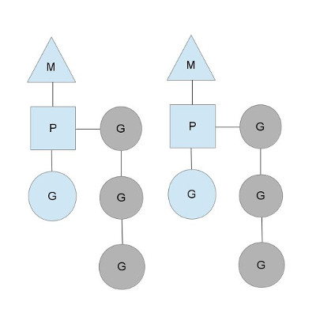

### goroutine

------

#### 1) 背景知识

* 系统CPU内核空间线程，用户空间线程。两个的关系是 1:1，1:M，N:M
* go通过在自身空间实现调度器来实现M:N。

#### 2) 概念

* go 语言中的协程

* 每个线程都有一个 P(context),由P来管理goroutine，维护一个runqueue, 

  

* 如果当前线程阻塞，会调度P绑定到一个新的线程上去，以此来保持继续

* 当某个P的任务跑完后，会从别的P出偷取任务

  

#### 3) 疑惑

* go 中的用户空间的线程数M是否是和具体的线程进行了绑定以减少不同线程间的切换。

